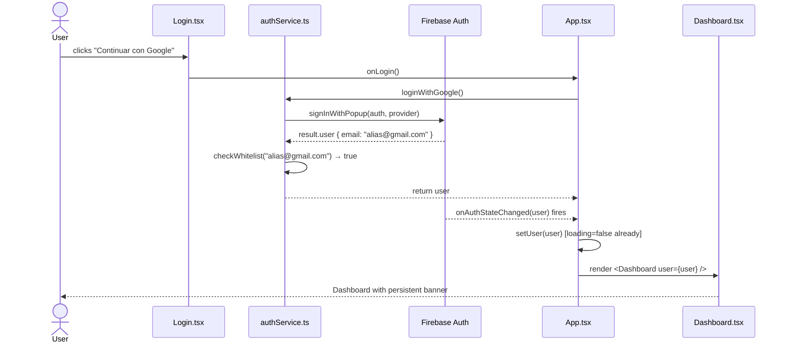
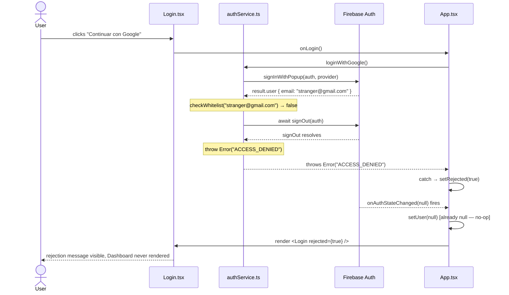

# Design — access-whitelist

**Change**: access-whitelist
**Project**: arg-bot-frontend
**Status**: approved
**Date**: 2026-04-19

---

## 1. Sequence Diagrams

### 1a. Happy path — whitelisted email



### 1b. Rejection path — non-whitelisted email



**Why Dashboard does NOT render between popup resolving and signOut completing:**
`signOut` is awaited inside `loginWithGoogle()` before it either returns or throws. The function does not return to `App.tsx` until after `signOut` resolves. Because `onAuthStateChanged` is driven by Firebase's internal state (which updates asynchronously after signOut), and React batches state updates within the same microtask chain, `App.tsx` never receives a `user !== null` signal from the listener during the window between popup resolution and signOut completion. The render gate (`user === null || rejected`) acts as a belt-and-braces second layer — even if the listener fired between the two, `rejected` would already be set to `true` and `<Login>` would remain mounted.

---

## 2. Module-Level Data Flow

```
┌─────────────────────────────────────────────────────────────────┐
│ Vite build                                                      │
│   VITE_WHITELIST_EMAILS (Render env var, baked into JS bundle)  │
└───────────────────────┬─────────────────────────────────────────┘
                        │ import.meta.env.VITE_WHITELIST_EMAILS
                        ▼ (module load, once)
┌─────────────────────────────────────────────────────────────────┐
│ src/authService.ts                                              │
│                                                                 │
│  WHITELIST: string[]   ← module-level constant (parsed once)    │
│                                                                 │
│  exports:                                                       │
│    checkWhitelist(email: string): boolean                       │
│      → WHITELIST.includes(email.toLowerCase().trim())           │
│    loginWithGoogle(): Promise<User>                             │
│      → signInWithPopup → checkWhitelist → [signOut + throw] |  │
│        return user                                              │
│    logout(): Promise<void>   (unchanged)                        │
└───────────────┬─────────────────────────────────────────────────┘
                │ loginWithGoogle() / throws ACCESS_DENIED
                ▼
┌─────────────────────────────────────────────────────────────────┐
│ src/App.tsx                                                     │
│                                                                 │
│  state:                                                         │
│    user: any | null          ← set by onAuthStateChanged        │
│    rejected: boolean         ← set by handleLogin catch         │
│    loading: boolean          ← cleared on first auth event      │
│                                                                 │
│  effects:                                                       │
│    onAuthStateChanged subscription (cleanup on unmount)         │
│                                                                 │
│  handleLogin():                                                 │
│    setRejected(false)        ← clears previous rejection        │
│    await loginWithGoogle()                                      │
│    catch ACCESS_DENIED → setRejected(true)                      │
│                                                                 │
│  render gate:                                                   │
│    loading           → loading spinner                          │
│    user !== null     → <Dashboard user={user} />                │
│    user === null     → <Login onLogin={handleLogin}             │
│                               rejected={rejected} />            │
└───────┬───────────────────────────────┬─────────────────────────┘
        │                               │
        ▼                               ▼
┌────────────────────┐     ┌────────────────────────────────────────┐
│ src/components/    │     │ src/Dashboard.tsx                      │
│ Login.tsx          │     │                                        │
│                    │     │  top-level persistent banner:          │
│  props:            │     │    "Acceso restringido —               │
│    onLogin: fn     │     │     solo usuarios autorizados."        │
│    rejected: bool  │     │  style: #7f1d1d bg, #fef2f2 text      │
│                    │     │                                        │
│  renders:          │     │  rest of existing Dashboard content    │
│    [banner]        │     │  (unchanged)                           │
│    Google button   │     └────────────────────────────────────────┘
│    [rejection msg] │
│      conditional   │
│      on rejected   │
└────────────────────┘
```

---

## 3. Env Var Lifecycle

### When it is read
`import.meta.env.VITE_WHITELIST_EMAILS` is read **once, at module load time**, when `authService.ts` is first imported by the bundled application. It is NOT read on every call to `checkWhitelist` or `loginWithGoogle`.

### How it is parsed
```
raw string  →  split(",")  →  map(s => s.trim().toLowerCase())
            →  filter(s => s.length > 0)
            →  WHITELIST: string[]
```

Both sides of the comparison are lowercased: the stored list entries and the incoming `email` argument inside `checkWhitelist`. This makes matching case-insensitive end-to-end.

### Where the parsed value lives
A module-level `const WHITELIST: string[]` inside `src/authService.ts`. It is initialized once when the module executes and shared across all calls in the same page session.

### What happens at Render redeploy
Render rebuilds the Vite bundle with the new env var value baked in. The old bundle is replaced. All new page loads receive the updated WHITELIST. There is no runtime config file — the value is inert JavaScript after build.

### Failure modes

| Scenario | Behavior | Design intent |
|---|---|---|
| `VITE_WHITELIST_EMAILS` missing / undefined | `WHITELIST = []` → every login rejected | **Fail-closed** — correct |
| Empty string `""` | Same as missing | Fail-closed |
| Trailing commas `"a@b.com,"` | Filter removes empty string → `["a@b.com"]` | Tolerated |
| Mixed case `"Fabio@Gmail.com"` | Lowercased to `"fabio@gmail.com"` | Tolerated |
| Whitespace `" a@b.com "` | Trimmed → `"a@b.com"` | Tolerated |
| Non-email garbage `"not-an-email"` | Stored as-is; never matches a real email | Silently inert |
| `null` / `undefined` email argument | `email?.toLowerCase().trim()` → empty string → no match | Rejected cleanly |

---

## 4. Flash-Prevention Mechanism — Why It Is Guaranteed

There are two independent, reinforcing layers. Either one alone is sufficient; together they are belt-and-braces.

### Layer 1 (primary): signOut awaited inside loginWithGoogle

`loginWithGoogle()` is a single `async` function. The control flow is:

```
signInWithPopup resolves
  → checkWhitelist(email) === false
    → await signOut(auth)        ← Firebase internal state cleared here
    → throw Error("ACCESS_DENIED")
```

`App.tsx`'s `handleLogin` only returns from `await loginWithGoogle()` AFTER `signOut` has resolved (or it throws). Firebase's `onAuthStateChanged` listener fires asynchronously in response to the internal auth state change triggered by `signOut`. Because the signOut is fully awaited before `loginWithGoogle` returns, the sequence from React's perspective is:

1. `loginWithGoogle` throws
2. `catch` block: `setRejected(true)` — React schedules re-render
3. `onAuthStateChanged(null)` fires — `setUser(null)` — React schedules re-render
4. React batches both state updates into one commit: `user=null, rejected=true`
5. Render: `user === null` → `<Login rejected={true}>` — Dashboard never renders

The window where Dashboard could paint (user non-null, rejected=false) **does not open** because `loginWithGoogle` does not return until after `signOut`.

**What breaks Layer 1**: If `loginWithGoogle` is refactored to return the user before checking the whitelist, or if `signOut` is moved outside the function. The break would surface as a Dashboard flash test failure in Vitest.

### Layer 2 (belt-and-braces): App.tsx render gate on `rejected`

The render gate in App.tsx is:

```
user !== null  →  Dashboard
user === null  →  Login (regardless of rejected)
```

Because `onAuthStateChanged(null)` fires after any `signOut`, `user` will always end up `null` after a rejection. The `rejected` flag is not strictly required for the gate — its role is to carry the UI signal (`rejected={true}`) into `<Login>` so the rejection message renders. Even if a future refactor of Layer 1 allowed a brief `user !== null` window, the `rejected` state being set first in the catch block means the next render would have `rejected=true` AND (briefly) `user !== null` — which would show Dashboard momentarily. That is the scenario Layer 1 prevents.

**What breaks Layer 2**: Removing the `rejected` prop from `<Login>` or the `setRejected(true)` in the catch block. The app would not flash (because `user` becomes null via onAuthStateChanged), but the rejection message would never appear to the user.

**Combined guarantee**: Layer 1 prevents the flash. Layer 2 ensures the rejection message appears. Neither alone delivers the full UX requirement; both are needed.

---

## 5. Architecture Decisions with Rationale

### Decision 1: Option C (client-side guard) over Option A (Cloud Functions) and Option B (Firestore rules)

Client-side email check after `signInWithPopup` was chosen over server-side alternatives. Option A (Firebase `beforeCreate` Cloud Function) requires the Blaze billing plan and hours of infra setup that does not exist in this project — there is no `functions/` directory, no `firebase-functions` in `package.json`, no `firebase.json`. Option B (Firestore rules + client guard) requires enabling Firestore, writing security rules, and a ~30-minute stretch of new infrastructure — and Firestore has never been used in this project. Option C requires zero new infrastructure, matches the existing security posture (the backend already trusts client-supplied email without server-side Firebase token verification), and can be implemented entirely within the existing four source files. The accepted tradeoff: Firebase Auth creates a user entry before the client check runs. This is cosmetic — the app denies access and the user entry is harmless.

### Decision 2: Env var managed in Render dashboard, not in code

The whitelist is not committed to the repository. It lives exclusively in the Render dashboard as `VITE_WHITELIST_EMAILS`. This means adding or removing an authorized user requires only a Render env var edit and a redeploy (~1 minute) — no code change, no PR, no git history of personal alias emails. It also means the `.env` file never contains production whitelist values; `.env.example` documents the variable shape only.

### Decision 3: Aliases, not personal family emails

Because `VITE_*` variables are baked into the Vite bundle and are visible to anyone who opens DevTools → Sources, the whitelist entries must be Gmail aliases Fabio controls (e.g., `fabio.family.ar1@gmail.com`), not the personal emails of family members. Personal emails committed to a public bundle would be a privacy violation. Aliases deliver the same access control with no exposure risk. This constraint is noted in `.env.example`.

### Decision 4: Inline banners, no shared component

The project has no shared design system, no component library, and no existing alert/notice component. The whitelist banners appear in exactly two places: `Login.tsx` and `Dashboard.tsx`. Extracting a shared `Banner` component would add a file, a new import chain, and a props API for two static text strings with identical styling — pure overhead. YAGNI applies. Both banners use inline styles consistent with the project's existing convention. If a third banner site emerges, extraction is a straightforward refactor at that time.

### Decision 5: Module-level env var parsing (once, not per call)

`VITE_WHITELIST_EMAILS` is parsed into `WHITELIST: string[]` at module load time, not inside `checkWhitelist`. This has two benefits: (1) `checkWhitelist` is a pure function with no I/O or environment access — it receives a string and returns a boolean, making it trivially testable via `vi.stubEnv` before module load; (2) the split/trim/lowercase work is done once regardless of how many times `loginWithGoogle` is called in a session. The tradeoff (env var changes require a page reload) is irrelevant because `VITE_*` vars require a full Render redeploy to change anyway.

### Decision 6: Typed error marker `ACCESS_DENIED` (not a boolean return)

`loginWithGoogle` throws `Error('ACCESS_DENIED')` instead of returning a boolean or a discriminated union. This preserves the existing call-site pattern in `App.tsx` where errors from `loginWithGoogle` are caught in a `try/catch`. Adding a boolean return would require `App.tsx` to inspect the return value AND handle exceptions — two error paths for one call. The `ACCESS_DENIED` string is a typed marker that the catch block can inspect (`error.message === 'ACCESS_DENIED'`) to distinguish a whitelist rejection from a genuine Firebase error (e.g., popup closed by user, network failure). Both cases are caught; only `ACCESS_DENIED` sets `rejected=true`.

---

## 6. Testing Architecture

### Environment
- Runner: Vitest 4 (`npm run test:unit`)
- DOM: jsdom
- File: `src/tests/AccessWhitelist.test.jsx`
- Matches Vitest include pattern: `**/tests/**/*.test.{js,jsx,ts,tsx}`

### Mocking strategy

**Firebase Auth** (`vi.mock('firebase/auth')` at top of file):
```js
vi.mock('firebase/auth', () => ({
  getAuth: vi.fn(),
  GoogleAuthProvider: vi.fn(),
  signInWithPopup: vi.fn(),
  signOut: vi.fn(),
  onAuthStateChanged: vi.fn(),
}))
```
Pattern matches `App.test.jsx`. `signInWithPopup` is configured per-test via `vi.mocked(signInWithPopup).mockResolvedValue(...)`. `signOut` is configured to resolve or reject per-test.

**Env var** (`vi.stubEnv` before module import):
```js
vi.stubEnv('VITE_WHITELIST_EMAILS', 'allowed@gmail.com,other@gmail.com')
```
Because `WHITELIST` is a module-level constant, tests that need different env values must use `vi.resetModules()` + dynamic `import()` AFTER `vi.stubEnv`. Tests that use the same whitelist value can share the module import.

**`firebaseConfig.ts`** — mocked via `vi.mock('../firebaseConfig', () => ({ auth: {} }))` to prevent real Firebase initialization.

### Test layering (TDD order — red first)

**Layer 1 — Pure function tests for `checkWhitelist`**
These run without Firebase, without React. They import only `authService.ts` (with `VITE_WHITELIST_EMAILS` stubbed).

| Test | Input | Expected |
|---|---|---|
| whitelisted email | `"allowed@gmail.com"` | `true` |
| non-whitelisted email | `"stranger@gmail.com"` | `false` |
| empty whitelist (env missing) | any email | `false` |
| case-insensitive match | `"Allowed@Gmail.Com"` | `true` |
| whitespace in entry | `" allowed@gmail.com "` | `true` |
| null email | `null` | `false` |
| empty email | `""` | `false` |

**Layer 2 — Integration tests for `loginWithGoogle`**
Mock Firebase Auth. Test the full function including the whitelist gate and signOut call.

| Test | Setup | Expected |
|---|---|---|
| whitelisted email returns user | `signInWithPopup` resolves with whitelisted email | returns user, `signOut` NOT called |
| non-whitelisted: signOut called | `signInWithPopup` resolves with non-whitelisted email | `signOut` called once |
| non-whitelisted: throws ACCESS_DENIED | same | `throw Error('ACCESS_DENIED')` |
| empty whitelist: always rejects | `VITE_WHITELIST_EMAILS=''` | `signOut` called, throws |

**Layer 3 — UI tests (React Testing Library)**
Mount components with mocked `loginWithGoogle` via `vi.mock('../authService')`.

| Test | Component | Expected |
|---|---|---|
| login banner renders | `<Login onLogin={vi.fn()} rejected={false} />` | `/Acceso restringido/i` visible |
| rejection message hidden by default | same | rejection text NOT in document |
| rejection message shows when rejected | `<Login onLogin={vi.fn()} rejected={true} />` | `/Cuenta no autorizada/i` visible |
| dashboard banner renders | `<Dashboard user={mockUser} />` | `/Acceso restringido — solo usuarios autorizados/i` |
| App: whitelisted user sees Dashboard | mock `loginWithGoogle` resolves, `onAuthStateChanged` fires with user | `<Dashboard>` mounts |
| App: rejected user stays on Login | mock `loginWithGoogle` throws ACCESS_DENIED | Login visible, Dashboard absent |

### Key mock patterns from existing test files

From `Calculator.test.jsx` and `Withdraw.test.jsx`:
- `beforeEach(() => { vi.clearAllMocks(); })` — reset between tests
- `vi.fn()` for callback props
- `screen.getByText(/regex/i)` for text matching
- `waitFor(...)` from `@testing-library/react` for async state updates
- No `act()` calls needed when using `waitFor` from RTL

---

## 7. File Change Summary

| File | Change type | What changes |
|---|---|---|
| `src/authService.ts` | modify | Add `WHITELIST` constant, `checkWhitelist()`, extend `loginWithGoogle()` |
| `src/App.tsx` | modify | Add `rejected` state, update `handleLogin`, pass `rejected` prop to `<Login>` |
| `src/components/Login.tsx` | modify | Add `rejected` prop to interface, render banner + conditional rejection message |
| `src/Dashboard.tsx` | modify | Add persistent top banner |
| `src/tests/AccessWhitelist.test.jsx` | new | Full TDD test suite (3 layers) |
| `.env.example` | new/modify | Document `VITE_WHITELIST_EMAILS=alias1@gmail.com,alias2@gmail.com` |

No new dependencies. No new files except the test file and `.env.example`.
